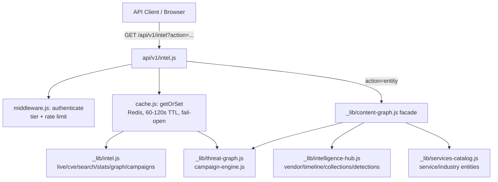
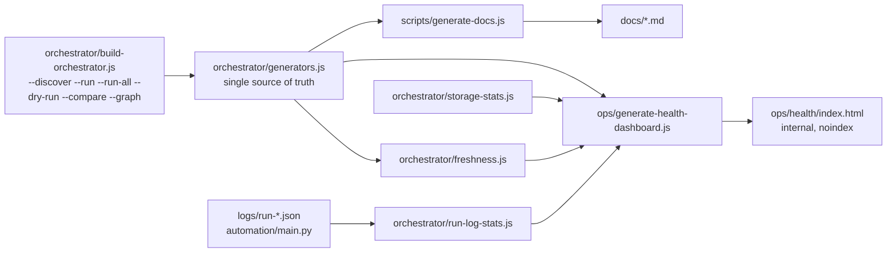

# Architecture Overview

_Hand-maintained (not auto-generated like the other docs/ files — a diagram's
value is in curated clarity, not exhaustive introspection). Update when the
generator registry or major data flows change meaningfully._

## Content & Publishing Pipeline

```mermaid
flowchart LR
    subgraph Sources["External Sources"]
        RSS[RSS / NVD / CISA KEV / 13+ feeds]
    end

    subgraph Generators["Six Production Generators (orchestrator/generators.js)"]
        LI[live-intel<br/>fetch-live-intel.js<br/>every 30 min]
        AI[ai-security-intel<br/>ai-security-intel-engine.js<br/>every 2h]
        BS[blogger-syndication<br/>automation/main.py<br/>every 2h]
        CP[cve-pages<br/>generate-cve-pages.js<br/>every 6h]
        IH[intelligence-hub<br/>generate-intelligence-hub.js<br/>every 6h]
        RF[rss-feed<br/>generate-rss.js<br/>every 6h]
    end

    subgraph Data["Generated Data (committed to repo)"]
        Posts[posts/*.html]
        CveJson[api/intel/cve/*.json]
        ProductJson[api/intel/products/*.json]
        Campaigns[api/intel/campaigns.json]
        ThreatGraph[api/intel/threat-graph.json]
        PubState[data/published_posts.json]
    end

    subgraph Site["Public Site (blog.cyberdudebivash.in)"]
        CvePages[/cve/*.html/]
        VendorPages[/vendor/*.html/]
        TimelinePage[/timeline/]
        CollectionsPage[/collections/]
        SearchPage[/search.html]
        Blogger[cyberbivash.blogspot.com]
    end

    RSS --> LI
    RSS --> AI
    LI --> Posts
    LI --> CveJson
    LI --> ProductJson
    LI --> Campaigns
    LI --> ThreatGraph
    CveJson --> CP --> CvePages
    ProductJson --> IH --> VendorPages
    ProductJson --> IH --> TimelinePage
    ProductJson --> IH --> CollectionsPage
    Posts --> RF
    Posts --> BS --> Blogger
    BS --> PubState
    Posts --> SearchPage
```

## API & Content Graph



## Observability & Build Tooling (Phase 4/5 additions)



## Notes

- **No single "app"**: this is a static site + a set of independent, cron-scheduled generator scripts + serverless API functions on Vercel — not a monolith. The orchestrator (added Phase 4) coordinates/reports on the generators without replacing their independent schedules.
- **Two separately-deployed products**: `blog.cyberdudebivash.in` (this repo — media/acquisition engine) and `intel.cyberdudebivash.com` (the separate Sentinel APEX CTI product) are deliberately kept architecturally distinct per `CLAUDE.md`'s ecosystem governance — the blog does not duplicate the CTI platform's live dashboards.
- **Storage is git-committed data**, not a database — `api/intel/*.json`, `posts/*.html`, `logs/*.json` are all committed files. This is simple and fully version-controlled, at the cost of unbounded repo growth (see the Enterprise Readiness Review's Scalability section).
